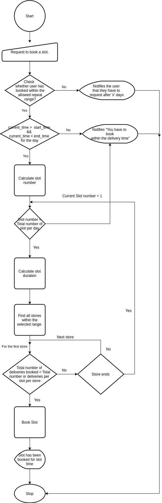

# Why do we need a virtual Queue?
Maintaining social distancing measures remains a big challenge during times of pandemics.
The virtual queuing system helps maintain social distancing measures by switching to online tickets to represent their places in the queue. This enables to limit queues and help manage capacity.
Existing system can be integrated to the system, representing a virtual system integrated to the existing actual systems. 
This helps to seperate groups and enable users to join a virtual queue line.

# How do the users interact?
* Admins must be allowed to set the start and end time of the delivery time.
* Admins must be allowed to set the working days.
* Admins must be allowed to mark the holidays for a financial year.
* Admins must be allowed to mark an unplanned holiday.
* Admins must be allowed to add the store details and locations.
* Admins must be allowed to set the slot duration.
* Admins must be allowed to set the number of users during a time slot for a store.
* Admins must be allowed to set a penalty time block for a user, if failed to be present on the alloted time.
* Admins must be allowed to scan and verify a generated queue ticket.
* End user must be allowed to book a slot.
* End user must be allowed to cancel a slot.

# How to solve?
## How to calculate the a time slot based on any time?
### How admin sets the slot setting?
1. Admin sets the start and end delivery time. say <i>tstart</i> & <i>tend</i>. By default it would be 10 AM to 9 PM.
2. Admin sets the slot duration. say <i>tduration</i>. By default it is 15 minutes.
3. Admin sets the total number of deliveries for a time slot for a store. say <i>d</i>. By default is 10.
4. Admin add the store with their details and location.
5. Admin sets how often the user can repeat the request. By default is 5 days.

Thus,  
The total number of slots per store (say <i>Tstore</i> ) is   
Tstore = (tend - tstart)/td  
The total number of slots available per day (say Tday) is 
Tday = Nstore * Tstore ; <i>where Nstore is the total number of stores</i>.   
The total number of deliveries per day (say Dday). 
Dday = d * Tday 

### How slot is booked for a user?
1. User request for a time slot. let the current time during computation be tcurrent.
2. User selects the applicable store locations distance range. By default is 5 KM.

Thus,  
The current time slot ncurrent is  
ncurrent = (tcurrent - tstart)/td ; <i>where tcurrent > tstart & tcurrent < tend</i>  
The start time for any slot, say tn 
tn = t0 + ntd  
The Slot tuple for any time, say Slotn 
Slotn = (tn, tn + td)
#### How the system inteprets?

## How a user cancels a ticket booked?
Once a ticket is booked the user is presented with a QR Code which would be scanned at the store to validate the booking.
The user is bound to cancel the ticket before the time slot expires as it would cease a chance for another user to use the booking slot. Thus the user is bound for a penalty that restricts the user to book tickets for a configured penalty period by the admin. The user should cancel the ticket to prevent penalty, if he cannot make himself available during the alloted time slot.
The user when prompts for a cancellation of the alloted booking, where the system marks the booking as cancelled.

## How the booking ticket is validated? 
Once a ticket is booked for a user, he would be presented with a ticket in the form of a QR code.
The QR code is then scanned at the store to validate the ticket, which the system marks as delivered.